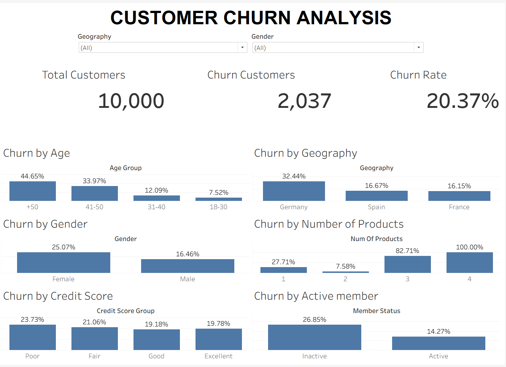

# Bank Customer Churn Analysis

## Project Overview

This project analyzes customer churn using a dataset of 10,000 bank customers. The objective is to identify the key factors associated with customer churn and provide actionable business recommendations through data-driven analysis.

The project demonstrates an end-to-end data analysis workflow, including data cleaning, exploratory data analysis (EDA), dashboard development, and business insight generation.

---

## Business Problem

Customer churn is one of the most important challenges in the banking industry. Losing existing customers can significantly impact profitability and customer lifetime value.

The objective of this project is to identify customer segments with higher churn rates and provide insights that can support customer retention strategies.

---

## Dataset

The dataset contains **10,000 bank customer records** with demographic, financial, and behavioral information.

Key variables include:

- Credit Score
- Geography
- Gender
- Age
- Tenure
- Balance
- Number of Products
- Has Credit Card
- Is Active Member
- Estimated Salary
- Exited (Customer Churn)

---

## Tools & Technologies

- SQL
- Microsoft Excel (Power Query)
- Tableau Public
- Visual Studio Code
- Git & GitHub

---

## Project Workflow

### 1. Data Cleaning

- Imported and explored the dataset.
- Checked for missing values and duplicate records.
- Standardized data types.
- Created grouped variables for analysis:
  - Age Group
  - Credit Score Group
  - Balance Group
  - Salary Group
  - Tenure Group
  - Member Status

### 2. Exploratory Data Analysis (SQL)

SQL was used to explore the dataset and answer business questions, including:

- Total Customers
- Churned Customers
- Overall Churn Rate
- Churn by Age Group
- Churn by Geography
- Churn by Gender
- Churn by Credit Score
- Churn by Number of Products
- Churn by Active Member
- Churn by Balance
- Churn by Tenure

### 3. Dashboard Development

An interactive Tableau dashboard was created to visualize customer churn patterns.

Dashboard includes:

- KPI Cards
- Churn Rate by Age Group
- Geography
- Gender
- Number of Products
- Credit Score
- Active Member Status

Interactive features include:

- Geography Filter
- Gender Filter
- Dynamic Tooltips
- Customer Count
- Churned Customer Count
- Churn Rate

---

## Dashboard Preview



---

## Key Business Insights

- Customers aged **50+** have the highest churn rate.
- Germany has the highest customer churn among all regions.
- Female customers churn more frequently than male customers.
- Inactive customers are significantly more likely to leave the bank.
- Customers with three and four products experience the highest churn rates.
- Credit score shows a relatively weak relationship with churn compared to customer engagement and demographics.

---

## Business Recommendations

- Increase customer engagement through personalized offers and loyalty programs.
- Prioritize retention strategies for high-risk customer segments.
- Investigate customers holding multiple products to better understand the reasons for churn.
- Develop region-specific retention strategies for Germany.
- Continuously monitor customer churn using interactive dashboards.

## Dashboard Preview


---

## Repository Structure

```
Bank-Customer-Churn-Analysis
│
├── Cleaned Data
│ 
├── Raw Data
│ 
├── Database
│    └── ChurnDB
│ 
├── SQL
│   └── EDA.sql
│
├── Tableau
│   └── Customer_Churn_Dashboard.twbx
│
├── Images
│   └── Dashboard.png
│
├── Business_Insights.md
│
└── README.md
```

---

## Skills Demonstrated

- Data Cleaning
- SQL Querying
- Exploratory Data Analysis (EDA)
- Data Visualization
- Dashboard Design
- Business Analysis
- Data Storytelling
- Business Recommendations

---

## Author

**Kamand Tolou**

GitHub: [@kamandtolou](https://github.com/kamandtolou)

LinkedIn: [Kamand Tolou](https://www.linkedin.com/in/kamand-t-0546052bb/)
